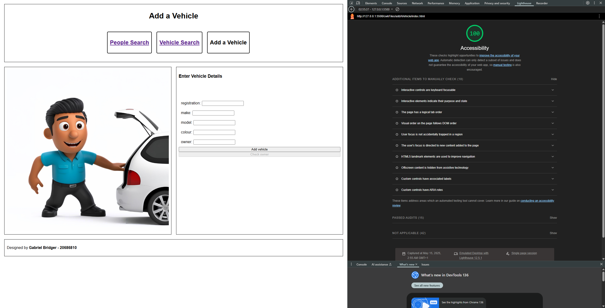
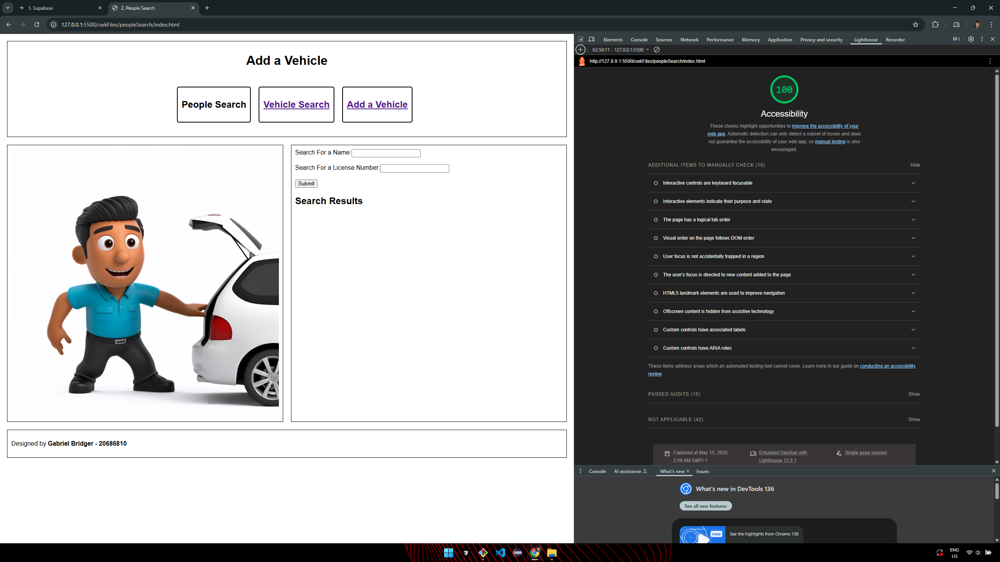
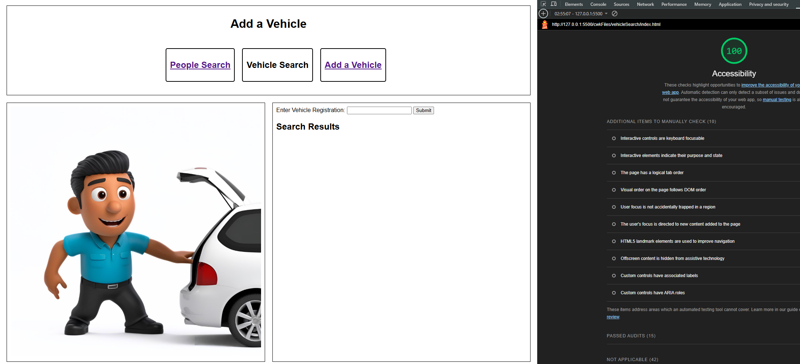
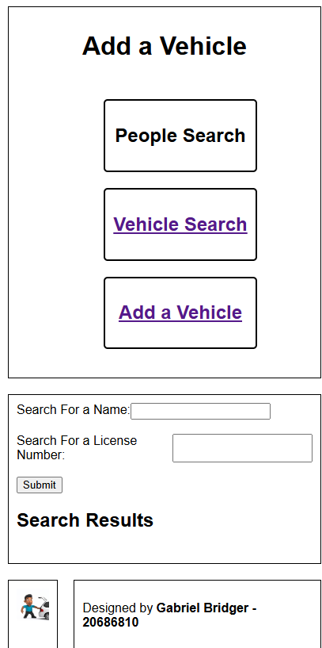
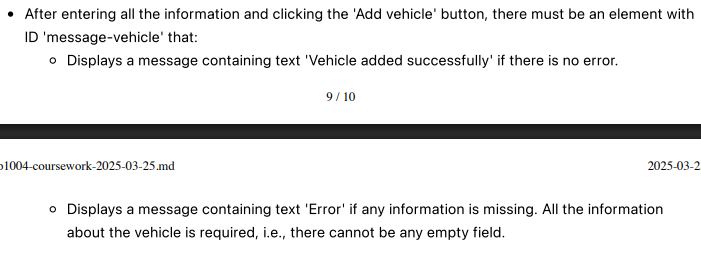
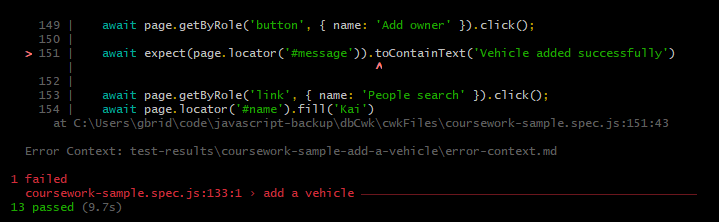

# Coursework Addtional Work Breakown
***Gabriel Bridger***
 

|Section|Link|
|-------|----|
|HTML|[Jump to HTML](#html-additional-work)|
|CSS|[Jump to CSS](#css-additonal-work)|
|JS|[Jump to Javascript](#javascript-additional-work)|
|Testing|[Jump to Testing](#testing)|

## HTML Additional Work 
### Add Vehicle
Below you can see the `Add Vehicle` page got 100/100 in the chrome accessability score:

 

### People Search
Similarly below the `People Search` page also got a score of 100 from the chrome dev tool:

 

### Vehicle Search
Finally below there is the image of the `Vehicle Search` page also getting 100/100 in the accessability score:

## CSS Additonal Work
### Responsive layout
For the CSS file one of the additional pieces of work was creating a responsive layout so that when the screen width was <500px in width the format of the grid changes to ensure that the website is still readable by moving the side bar - implemented through `aside` is moved below `main` and alongside the `footer`.

### My Implementation
To create the responsive layout I first needed to be able have an `@Media` condition to adjust the formatting based on the width of the window. So because the documentation speciifed that the layout should only change when the `view width`<500px I used a `max-width` condition - line 86 in [`style.css`](style.css) - so that whenever the width of the screen was under the 500px threshold the formatting would change.

**Re-Positioning the Sidebar**
Now that I had a condition that could differentiate the layout I redifined the `grid-template-columns` - line 89 - to have 2 columns with a width ratio to each other of 1:4 - as per the specification. Then to ensure that the side bar `aside` sat below the `main` container - although before it had been next to it - I opted to use the `order` keyword to essentially move the element down the order of the page, and then by changing the main to span 2 columns rather than 1 - line 94 - it meant that naturally `aside` was pushed below the `main` container then to keep `aside` and `footer` stayed horizontally level i gave them the same order - lines 98 & 103 - and then as the columns width's had been changed to a ratio of 1:4 - line 89 - all I had to do to finish off aligning the **sidebar** and **footer** was assign them to their corresponding columns.

**Changing Navbar Direction**
Changing the `navBar` to go from horizontally aligned to vertically aligned was fairly rudimentary because it just took changing the direction of the flex container from being `horizontal` (row aligned) to being `vertical` (column aligned) and then all the other properties could be kept the same. 

**Changing the Results grid**
Another requirement was changing the formatting of the results that were outputted when searching, similarly to **changing the navBar direction** all this took was a quick re-defining of the template for the grid that the results were displayed on. By changing the to a grid with a single column it meant that any results had to go on top of on another because the grid didn't have enough space due to it automatically taking the width of the parent container - `results` - and hence producing the required responsive layout.

*Image of the webpage where width <500px*

## Javascript Additional Work
**Playwright Tests**
For the additional Playwright tests I created a few non-exhaustive test cases that mainly check the people/vehicle search pages for when not all the inputs were entered or for if too many inputs were enetered - in the case of the inputs for vehicle search. Then in addition I created some boundary tests for the `Add Vehicle` page for when all but one input is filled in.

These tests can be found in the [custom tests file](/cwkFiles/custom-tests.spec.js)

And as seen below my code solution passed all the tests from both the new custom created ones and the sample ones given:

## Testing
**Mis-matched Div Names**
I believe there was one error between the provided playwright tests and the documentation/specification we were given.

From what I can see this comes in the form of a mis-matched `div` id in the `Add vehicle` section of the project. In the documentation it states:

*'After entering all the information and clicking the 'Add vehicle' button, there must be an element with ID 'message-vehicle' that: Displays a message containing text 'Vehicle added successfully' if there is no error.'*

As shown below:

and in that section there is no mention of the `Add Vehicle` page having a div with id `#message` only `message-vehicle` and `message-owner`. However in the playwright tests when checking to see if the vehicle was correctly added after creating a new owner and vehicle the playwright test searches for a `#message` div within the `Add Vehicle` page even though the documentation specifies that none is needed. 

This can be seen by the failed playwright test in which the reason for failure is highlighted as not being able to find the element with id `#message` within `Add Vehicle` - as shown below:

So to get around this in my code I have added 2 divs - `message-vehicle` and `message` - due to being unsure which one was actually being asked for, they should behaive the exact same as the function that sets the feedback messages for the `message-vehicle` - lines 21 - 24 in [add vehicle source](/cwkFiles/addAVehicle/src.js) - as I have both divs set at the same time with the same messages.

